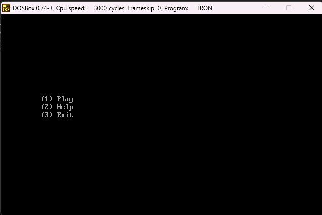
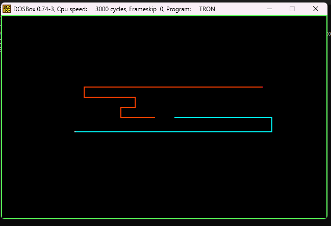
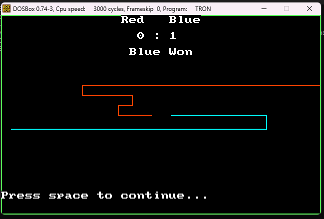
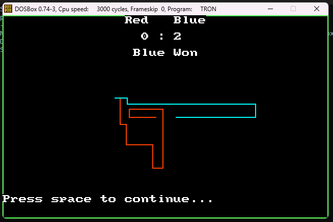

# Description

A Tron game written for DOS ( Windows XP )

The MASM.EXE and LINK.EXE are an older version of Microsoft Macro Assembler

## Controlls

Player 1: RED ( arrows )

Player 2: BLUE ( w,a,s,d )

## Rules

don't collide with a wall, and don't collide with your trail or with the others players' trail

## How to Run

```bash
masm tron
# enter, enter, enter
link tron
# enter, enter, enter
tron
```

## Preview








